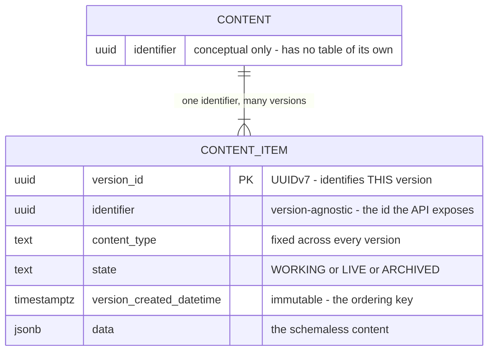
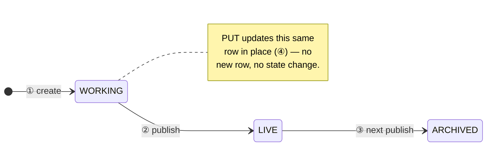
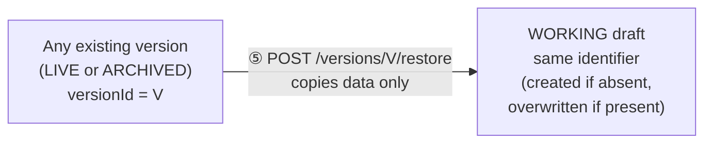
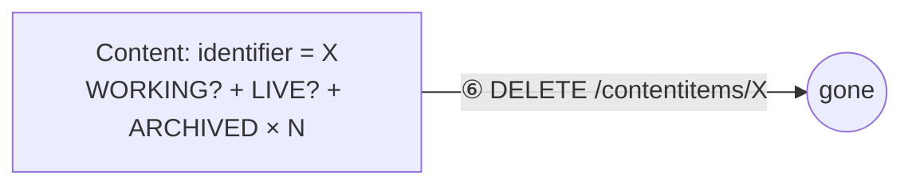
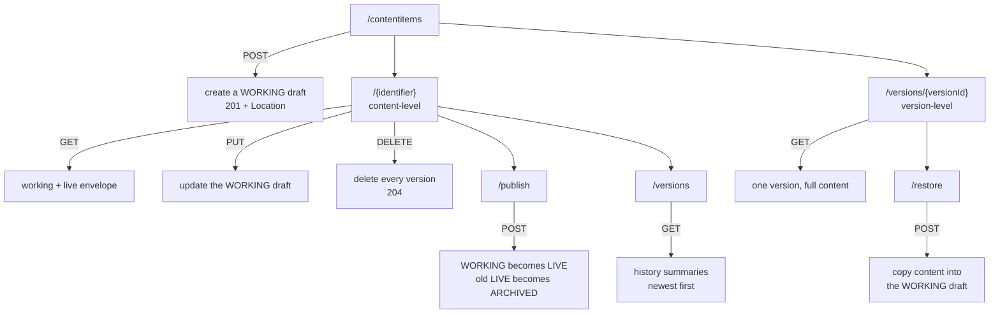
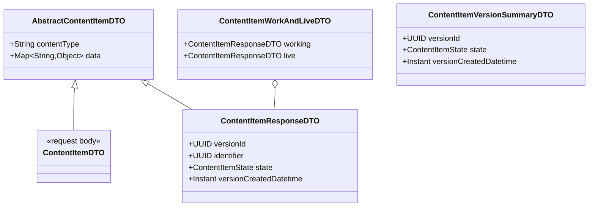
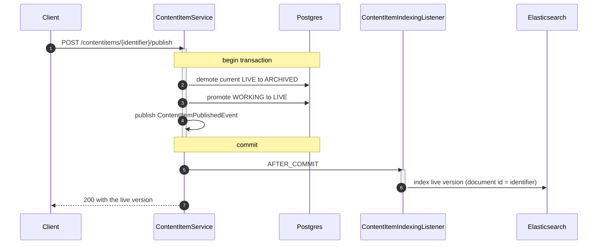

# Content model: versions, lifecycle, and API surface

How a **content item** is stored, how its versions move through the editorial lifecycle, and how
that model is exposed over REST. This is the reference for roadmap item 5
(*content versioning: live / working / history*); see [roadmap.md](roadmap.md) for the surrounding
initiatives and the deferred follow-ups.

## 1. Persistence model

Everything lives in one table, `content_item`. **Each row is one version** of one logical content.

There is deliberately **no `content` table**: a "logical content" is not a row anywhere — it exists
only as the set of rows sharing an `identifier`. That keeps the write path to a single table, but it
means the invariants that make the model coherent ("exactly one live version") are enforced by
indexes rather than by foreign keys.



### The two ids

The naming matters, because both are UUIDs and they are easy to confuse:

| | `identifier` | `version_id` |
|---|---|---|
| Identifies | the logical content | one specific version of it |
| Stability | constant for the content's whole life | new for every new version |
| Shared by | every version of that content | nothing — it is the primary key |
| Used in URLs for | content-level operations (update, publish, delete, read state) | version-level operations (read one version, restore) |

Both are server-generated UUIDv7 (`common.UuidV7`); clients never supply either.

### Invariants

Enforced by partial unique indexes (a payoff of the Postgres move, roadmap item 3) rather than by
application logic, so concurrent writers cannot break them:

| Index | Rule |
|---|---|
| `uq_content_item_live` — `UNIQUE (identifier) WHERE state = 'LIVE'` | at most **one LIVE** version per content |
| `uq_content_item_working` — `UNIQUE (identifier) WHERE state = 'WORKING'` | at most **one WORKING** draft per content |
| `ix_content_item_identifier` | (lookup support — every read is by identifier) |

`ARCHIVED` is uncapped: it is the history, and retention limits are deferred.

### Mutability

This is the core principle of the model:

- **`WORKING` is the only mutable row.** Editing a draft UPDATEs it in place, keeping its
  `version_id` and its original `version_created_datetime`.
- **`LIVE` and `ARCHIVED` are immutable.** Publishing flips a state, and demotion moves a row from
  `LIVE` to `ARCHIVED`, but neither ever rewrites `data`. History therefore stays trustworthy for
  audit and rollback.
- **Restore copies rather than moves** — it reads an old version's `data` into the working draft and
  leaves the source row untouched.

`version_created_datetime` is set once at row creation and never updated, which is what makes it a
safe ordering key. (An incrementing `version` integer was considered and rejected: assigning the
next number needs a `max(version) + 1` read on every write.)

## 2. Version lifecycle

Three separate diagrams, because they are three different *kinds* of change: the editorial flow
promotes and demotes rows in place; restore copies content sideways without moving anything; delete
removes a whole content's rows at once. Squeezing all three into one diagram is what made an earlier
draft of this doc hard to follow.

### 2.1 Editorial flow: create → publish → supersede

This is the state a single row moves through. Each step is numbered here and expanded in the table
below.



| Step | Trigger | What happens |
|---|---|---|
| ① create | `POST /contentitems` | a new row is inserted, state `WORKING` |
| ② publish | `POST /{identifier}/publish` | the row is promoted in place — same `version_id`, state flips to `LIVE` |
| ③ next publish | a later `POST /{identifier}/publish` | *this* row is demoted in place to `ARCHIVED`, and a (different) `WORKING` row is promoted to take its place as `LIVE` |
| ④ update | `PUT /{identifier}` | the `WORKING` row's `data` is overwritten in place; `version_id` and `version_created_datetime` are unchanged |

Publish is a two-row change inside one transaction, and the order matters: the current `LIVE` row
is demoted to `ARCHIVED` *before* the `WORKING` row is promoted, so the one-`LIVE`-per-identifier
invariant (`uq_content_item_live`) is never momentarily violated by having two `LIVE` rows at once.

A content does not always have both a working and a live version, and the API is explicit about it:

| Situation | `working` | `live` |
|---|---|---|
| Just created, never published | present | absent |
| Just published | absent | present |
| Published, then edited again | present | present |

Publishing consumes the working draft (the row *becomes* live), so a fresh draft is only created
lazily on the next update or restore.

### 2.2 Restore: copy, not move

Restore does not transition any row through the states above. It reads one existing version's
`data` and copies it into the `WORKING` draft — creating one if the content doesn't have one, or
overwriting the one it does. The source row is untouched.



| Step | Trigger | What happens |
|---|---|---|
| ⑤ restore | `POST /versions/{versionId}/restore` | `data` is copied from any version (`LIVE` or `ARCHIVED`) into the `WORKING` draft; the source row's state and content are never modified |

The restored draft can then be published like any other edit (step ②).

### 2.3 Delete: the whole content at once

Delete is not per-row either — it drops every version sharing an `identifier` in one statement,
regardless of state.



| Step | Trigger | What happens |
|---|---|---|
| ⑥ delete | `DELETE /contentitems/{identifier}` | every row for that `identifier` is removed, in every state, and the search document is removed after commit |

## 3. REST API surface

The URL shape mirrors the two ids: **content-level operations key off `identifier`**, and
**version-level operations key off the globally unique `version_id`**. A version is addressed
directly rather than nested under its content, because a `version_id` already determines which
content it belongs to — nesting would mean passing an identifier that exists only to be validated.



### Endpoints

| Method & path | Operation | Success | Notes |
|---|---|---|---|
| `POST /contentitems` | create | `201` + `Location` | mints a new `identifier` **and** `version_id`; state `WORKING`; not indexed |
| `PUT /contentitems/{identifier}` | update draft | `200` | updates the `WORKING` row in place, or creates one if the content has none; `contentType` is immutable |
| `POST /contentitems/{identifier}/publish` | publish | `200` | `WORKING` → `LIVE`, previous `LIVE` → `ARCHIVED`; indexed after commit |
| `GET /contentitems/{identifier}` | read editorial state | `200` | `{ working, live }` — either may be `null` |
| `GET /contentitems/{identifier}/versions` | history | `200` | summaries only (no content), newest first |
| `GET /contentitems/versions/{versionId}` | read one version | `200` | full content of that exact version |
| `POST /contentitems/versions/{versionId}/restore` | restore | `200` | copies into the `WORKING` draft; source row unchanged |
| `DELETE /contentitems/{identifier}` | delete | `204` | removes every version, and the search document |

### Response shapes



The schemaless content is **nested under `data`**, so the fixed/system fields stay flat at the top
level and client content can never collide with or override them:

```json
{
  "contentType": "Blog",
  "data": { "title": "Hello", "language": "en" }
}
```

A response adds the system fields alongside — never inside — `data`:

```json
{
  "contentType": "Blog",
  "versionId": "0199...",
  "identifier": "0198...",
  "state": "LIVE",
  "versionCreatedDatetime": "2026-07-05T21:14:03Z",
  "data": { "title": "Hello", "language": "en" }
}
```

`ContentItemVersionSummaryDTO` deliberately omits `data` — a history listing never returns content.

### Error semantics

All failures carry an RFC 9457 `application/problem+json` body.

| Status | When |
|---|---|
| `400` | blank `contentType`; `contentType` changed on update; nothing to publish |
| `404` | unknown `identifier`; unknown `versionId` |
| `409` | a concurrent write lost the race on a uniqueness invariant |

## 4. Dual write to Elasticsearch

**Only `LIVE` versions are indexed** — drafts are invisible to delivery search. The search document
is keyed by `identifier`, so each publish overwrites the single live document for that content, and
a `versionId` field records exactly which version is indexed (`SearchController` hydrates hits back
from Postgres by that `versionId`, giving an exact document-to-row match).

Indexing is driven by domain events consumed **after the transaction commits**, so a rolled-back
publish can never leave a stale document behind:



`DELETE` follows the same pattern via `ContentItemDeletedEvent`, removing the document by
`identifier` after commit.

## Known gaps

Tracked as deferred follow-ups under item 5 in [roadmap.md](roadmap.md):

- **Lost update on the working draft.** Two concurrent edits to the same `WORKING` row both UPDATE
  it and the last write silently wins. A `@Version` optimistic-lock column would turn the losing
  edit into a handled conflict.
- **Version listing reads content it discards.** The history query loads full rows, fetching every
  version's `data` blob only for the mapper to drop it.

Also out of scope here: indexing working versions for editorial search, history retention caps, and
content grouping / language variants (item 6).
