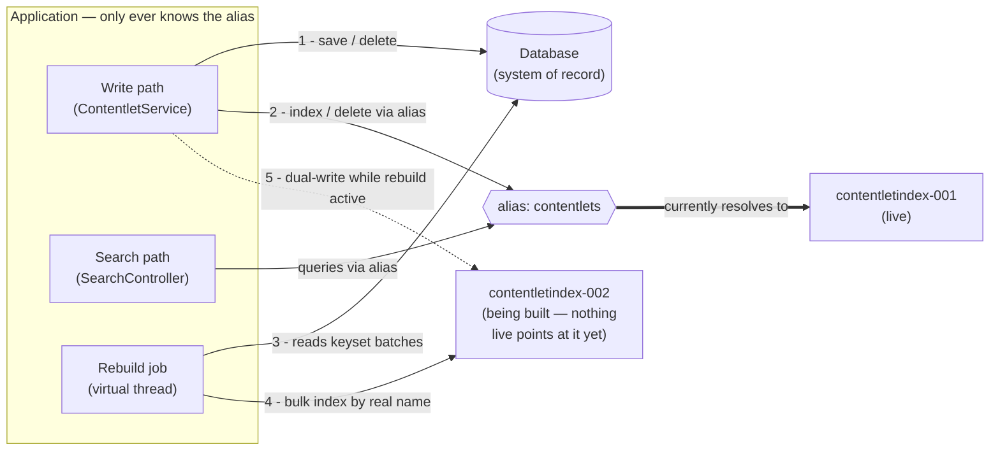
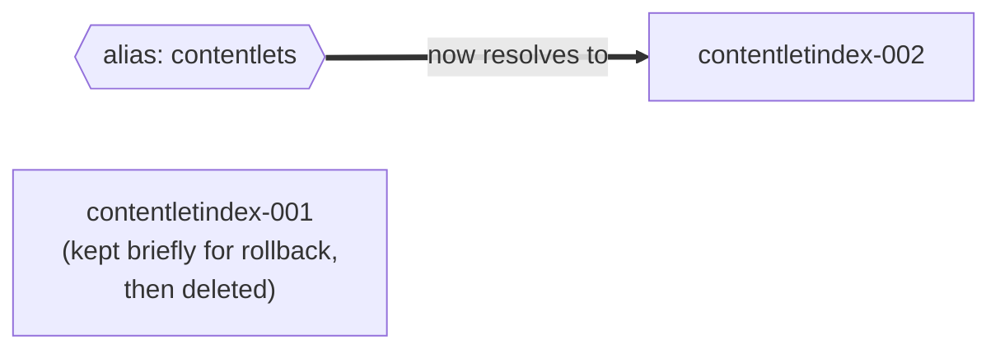
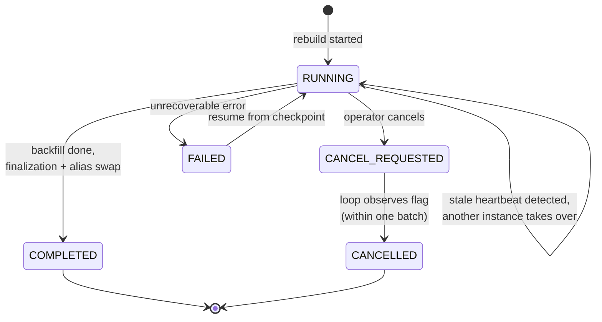
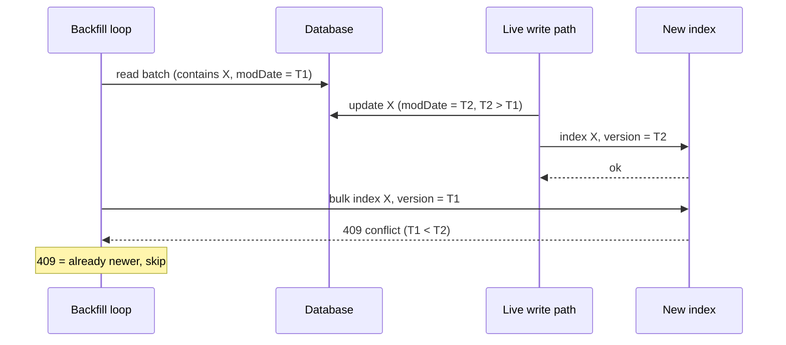
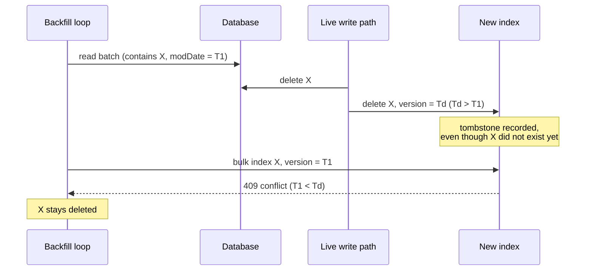
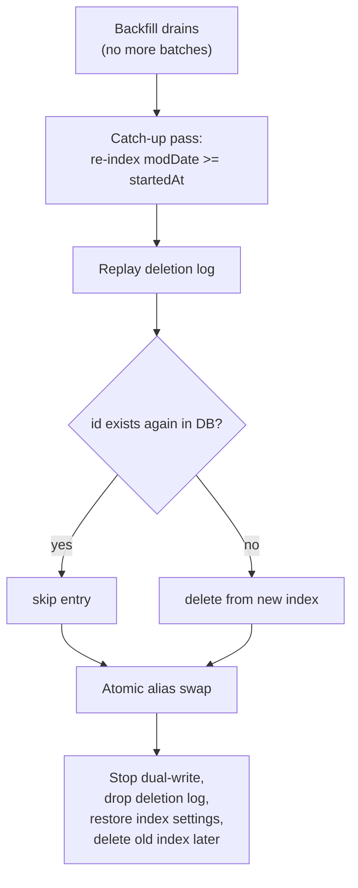

# Elasticsearch Index Rebuild — Design

## Problem

Contentlets are saved to the database (system of record) and indexed into Elasticsearch
(see `ContentletService`). Periodically the index must be rebuilt from scratch — e.g. the
old index has accumulated garbage, or mappings/settings need to change as content evolves.
A rebuild walks tens of thousands of records, so it is a long-running process that must be:

1. **Cancellable** — an operator can stop it cleanly.
2. **Resumable** — if the instance running it dies, the rebuild continues from where it left off.
3. **Consistent with live traffic** — creates, updates, and deletes that happen *during* the
   rebuild must be reflected in the new index by the time it goes live.

Assumptions:

- Non-reactive code style (Java 21 virtual threads, blocking repositories/clients).
- Database may be MongoDB or Postgres — the design avoids anything specific to either.

## High-level approach: alias swap

The application never reads or writes a concrete index name. It uses an **alias**
(e.g. `contentlets`), and the `IndexCoordinates` bean points at the alias. Rebuilds create a
new generated-name index (e.g. `contentletindex-2026-06-09-001`), backfill it from the
database, then atomically repoint the alias.

Snapshot **while a rebuild is in progress** (solid arrows are always true; the dashed arrow
exists only while a rebuild is active):



Reading it as two parallel paths:

- **Live path** (1–2): normal traffic is untouched. Reads and writes address the alias, which
  Elasticsearch resolves to the old index. Users are served from `001` for the entire rebuild.
- **Rebuild path** (3–4): the job reads content from the database in batches and bulk-writes
  the new index *by its real name*, bypassing the alias — invisible to live traffic.
- **Dual-write** (5): only while a rebuild is active, live saves/deletes are also applied to
  the new index so changes made during the rebuild aren't missing from it
  (see "Handling live writes during the rebuild").

When the backfill finishes, a single `_aliases` request (remove from old, add to new — atomic
from the application's point of view) repoints the alias:



The application changes nothing at swap time — it only ever knew the alias.

`IndexController` changes from "create the fixed-name index" to: create a new generated-name
index (with mappings + rebuild-time settings), start a rebuild job, and expose cancel/status
endpoints.

## The rebuild job

### Job record

The job's entire state lives in the **database**, not in process memory. That single decision
provides cancellation, resumability, and observability.

```
reindex_job {
  id:               string        // job id
  targetIndex:      string        // the generated index name being built
  status:           RUNNING | CANCEL_REQUESTED | CANCELLED | COMPLETED | FAILED
  lastProcessedId:  string        // keyset checkpoint — last contentlet id written
  startedAt:        timestamp
  heartbeatAt:      timestamp     // refreshed every batch; stale => job is orphaned
  processedCount:   long          // progress reporting, advanced with each checkpoint
  totalCount:       long          // denominator for progress, set at start, corrected on resume
}
```

### Batch loop

The job runs on a virtual thread as a plain blocking loop:

```java
while (true) {
    var job = jobRepository.findById(jobId);          // re-read every iteration
    if (job.status() == CANCEL_REQUESTED) {
        jobRepository.updateStatus(jobId, CANCELLED);
        return;
    }

    var batch = contentletRepository
        .findByIdGreaterThanOrderByIdAsc(job.lastProcessedId(), BATCH_SIZE);
    if (batch.isEmpty()) break;                       // backfill done

    var esDocs = transformForEs(batch);               // existing ESRecordTransformer pipeline
    bulkIndex(job.targetIndex(), esDocs);             // plain bulk; races repaired in finalization
    jobRepository.checkpoint(jobId, lastIdOf(batch), batch.size()); // also bumps heartbeatAt
}
finalizeAndSwapAlias(job);
```

Key properties:

- **Keyset pagination** (`WHERE id > :lastId ORDER BY id LIMIT :n`): every batch is an index
  seek, constant cost regardless of depth. Offset pagination (`skip`/`OFFSET`) degrades
  toward O(n²) over the whole rebuild and must be avoided. Each batch is a fresh short query,
  so MongoDB cursor timeouts never come into play. The same query shape works identically in
  MongoDB and Postgres, which keeps the migration path clean.
- The checkpoint is the keyset cursor. Crash, cancel, redeploy — resuming is just restarting
  the loop with the stored `lastProcessedId`.
- The backfill must reuse the **stored** entity (including its existing `modDate`) and only
  run the `ESRecordTransformer` step. Re-running the inbound
  `ContentletEntityTransformer` would re-stamp `modDate` to "now", writing wrong timestamps
  into the new index (and, under Option A below, forging versions).

### Lifecycle



- **Cancellation**: flip `status` to `CANCEL_REQUESTED` (via an endpoint); the loop checks it
  between batches, so cancellation takes effect within one batch.
- **Resumption / takeover**: a job in `RUNNING` whose `heartbeatAt` is older than a threshold
  is orphaned (its instance died). Any instance — on startup or via a periodic check — may
  take it over and continue from the checkpoint. A conditional update on `heartbeatAt`
  (compare-and-set) prevents two instances from claiming the same job.
- At most one active rebuild at a time: enforce by refusing to start a job while another is
  `RUNNING`/`CANCEL_REQUESTED` with a fresh heartbeat.

### Progress reporting

Estimated percentage = `processedCount / totalCount`, computed on the status endpoint.

- **`totalCount` is set once when the job starts** (in the rebuild handler, before the loop).
  At tens of thousands of records an exact count is cheap in either database; if the
  collection outgrows that, instant estimates are accurate enough for a progress figure
  (`estimatedDocumentCount()` in MongoDB, `pg_class.reltuples` in Postgres).
- **Recount on resume/takeover**: when an instance picks up an orphaned job, recount the
  remaining work — `count WHERE id > lastProcessedId` (same query shape as the batch fetch) —
  and reset `totalCount = processedCount + remaining`. This self-corrects any drift
  accumulated before the crash. The same recount can optionally run every N batches during
  normal operation to keep long-running jobs honest.
- The figure is an estimate: live creates and deletes during the rebuild drift the
  denominator. Clamp the displayed value at 99% until the job reaches `COMPLETED`, so it
  never shows 100% (or overshoots) while still running.

## Handling live writes during the rebuild

The backfill takes minutes; meanwhile the application keeps serving creates, updates, and
deletes. Whatever happens during that window must be in the new index before the alias swap.
Both options below start from the same base behavior — **dual-write**: once a rebuild starts,
`ContentletService.save` and `deleteById` apply the operation to the live alias *and* to the
new index. They differ in how they resolve races between the backfill and live writes.

### The two races

1. **Stale-update race**: the backfill reads contentlet X, a live update writes a newer X to
   the new index, then the backfill's older copy lands last and clobbers it.
2. **Delete-resurrection race**: the backfill reads X, a live delete removes X from the DB and
   both indices (a no-op on the new index if the backfill hasn't written X yet), then the
   backfill's copy lands and resurrects a deleted document.

Plain last-write-wins indexing handles neither — the design must pick one of the following.

### Option A — versioned dual-write

Every index/delete operation against the new index carries an **external version**
(`version_type=external_gte`), and Elasticsearch enforces "newer version wins" regardless of
arrival order:

- **Index operations** use the document's `modDate` as epoch millis. The backfill carries the
  stored `modDate`; live writes carry the freshly stamped one.
- **Delete operations** carry current wall-clock millis. Elasticsearch remembers deleted
  versions as **tombstones** for `index.gc_deletes` (default 60s) — and a versioned delete of
  a not-yet-existing document still records the tombstone.

Stale-update race, resolved:



Delete-resurrection race, resolved:



Bulk responses report conflicts per item; the backfill treats 409s as "already up to date"
and moves on. No end-of-job reconciliation is needed — when the loop drains, the index is
consistent and the alias can swap immediately.

Caveats:

- The tombstone only lives for `gc_deletes`. The dangerous backfill write can only be stale if
  the delete happened between that batch's read and its write, so the tombstone's age at write
  time is bounded by one batch's read-to-write latency (seconds). Still, set
  `index.gc_deletes` to e.g. `1h` on the new index for the duration of the rebuild
  (it is a dynamic per-index setting) and remove the worry entirely.
- `modDate` must be set on every save (it is — `StandardDMSContentTransformer` stamps it) and
  millisecond precision must be acceptable as a version. `external_gte` (not `external`) makes
  re-indexing an identical version idempotent rather than a conflict.
- Spring Data ES's plain `saveAll` does not carry versions for `EntityAsMap`; use
  `IndexQuery` (which has `version`/`versionType` fields) or the ES Java client's bulk API
  directly.

### Option B — naive dual-write + catch-up pass + deletion log (chosen)

Keep the write path dumb (unversioned dual-write, last-write-wins, races allowed to happen)
and repair the damage in a finalization phase before the swap:

- **Stale updates** are repaired by a **catch-up pass**: after the backfill drains, re-query
  `modDate >= startedAt` and re-index those documents. Any document clobbered by a stale
  backfill write is rewritten with its current state. Repeat with a narrowing window if the
  first pass is large; the final pass is small.
- **Deletes are invisible to `modDate` queries**, so deletions are recorded in a small
  **deletion log** (`deleted_contentlets`: id + timestamp, written in the same path as the DB
  delete while a rebuild is active). After the catch-up pass, replay the log against the new
  index. Guard against delete-then-recreate during the rebuild: skip the replay for any id
  that exists again in the database (or whose live `modDate` is newer than the log entry).



### Comparison

|                          | A — versioned dual-write | B — catch-up + deletion log |
|--------------------------|--------------------------|------------------------------|
| Update race              | Solved continuously by version comparison | Repaired by catch-up pass |
| Delete race              | Solved by delete tombstones | Repaired by deletion log replay |
| Write-path complexity    | Higher (versions on every op against new index) | Lower (plain dual-write + one log insert on delete) |
| End-of-job choreography  | None — swap when the loop drains | Catch-up pass, log replay with re-create guard, log cleanup |
| New persistence          | None | Deletion log table/collection |
| Failure modes            | Tombstone GC window (mitigated via `gc_deletes`) | Replay ordering bugs, log replay vs. re-create edge cases |
| ES coupling              | Relies on external versioning semantics | Only standard index/delete APIs |

**Decision: Option B.** The write path stays dumb and uses only standard index/delete APIs —
no external-versioning plumbing (which is awkward with `EntityAsMap`, requiring `IndexQuery`
or raw bulk calls), and no reliance on tombstone GC semantics. The cost is accepted: a
finalization phase (catch-up pass + deletion log replay with the re-create guard) runs after
the backfill drains and before the alias swap, and the deletion log is a small extra
table/collection. Option A is documented above as the alternative if the finalization
choreography ever becomes a problem.

## Elasticsearch settings during the rebuild

Create the new index with bulk-friendly settings, restore them before the swap:

| Setting | During backfill | Before swap |
|---|---|---|
| `refresh_interval` | `-1` (no refreshes) | restore (e.g. `1s`), force a refresh |
| `number_of_replicas` | `0` | restore production value, wait for green |
| `gc_deletes` (Option A) | `1h` | restore default |

## Database considerations

- **Keyset pagination is the only DB-sensitive piece**, and it is portable:
  `find({_id: {$gt: lastId}}).sort({_id: 1}).limit(n)` in MongoDB,
  `WHERE id > ? ORDER BY id LIMIT ?` in Postgres. No streaming cursors held across batches,
  so no cursor-timeout or connection-pinning concerns in either database.
- **Correctness does not depend on id format** — any stable total order works, and mixed id
  styles in existing data are fine.
- **Prefer UUIDv7 for new ids.** Time-ordered ids append to the right edge of the primary-key
  B-tree (cheaper inserts, especially in Postgres) and give the backfill scan locality
  (batches read pages written together). The standard hex form sorts correctly as a string
  (timestamp occupies the most significant digits), so it works with the current `String` id
  in MongoDB; in Postgres use a native `uuid` column, whose bytewise ordering also preserves
  v7 time order. Trade-off: v7 ids reveal creation time.
- The job record and (Option B) deletion log are plain documents/rows — nothing DB-specific.

## Job infrastructure: hand-rolled vs JobRunr vs Spring Batch

| | Hand-rolled loop | JobRunr | Spring Batch |
|---|---|---|---|
| Fit | ~150 lines on a virtual thread; checkpoint/cancel/heartbeat as above | Storage providers for both MongoDB and SQL; dashboard; distributed workers | Chunk-oriented restartable steps; `JobRepository` is JDBC-first (MongoDB support only since 5.2) |
| Resumability | Native to the design (checkpoint in DB) | Retries re-run the job from the start — the checkpoint pattern is still needed; JobRunr adds scheduling + "some instance picks it up" | Built-in via `ExecutionContext`, overlapping what the job record already does |
| Notes | No new dependencies; triggered from a controller | Survives the Postgres migration | Blocking-only is no longer a problem with virtual threads, but it is heavy machinery for one job |

**Recommendation: start hand-rolled.** The job-record design above *is* the hard part, and
every framework still needs it. Adopt JobRunr later if a dashboard, scheduling, or multi-node
job coordination beyond the heartbeat field becomes genuinely useful.

## Endpoints (sketch)

| Endpoint | Action |
|---|---|
| `POST /index/rebuild` | Create new generated-name index (mappings + rebuild settings), insert job record, enable dual-write, start loop on a virtual thread. 409 if a rebuild is active. |
| `GET /index/rebuild/{jobId}` | Job status + progress (`processedCount`, `totalCount`, estimated percent, checkpoint, heartbeat). |
| `DELETE /index/rebuild/{jobId}` | Set `CANCEL_REQUESTED`; loop stops within one batch. Cleans up the abandoned index. |

## Rollback

The old index is not deleted at swap time. If the new index turns out bad, repoint the alias
back (accepting loss of writes made after the swap, or replaying them via a
`modDate >= swapTime` pass plus — under Option B — the deletion log). Delete the old index
after a confidence window.
