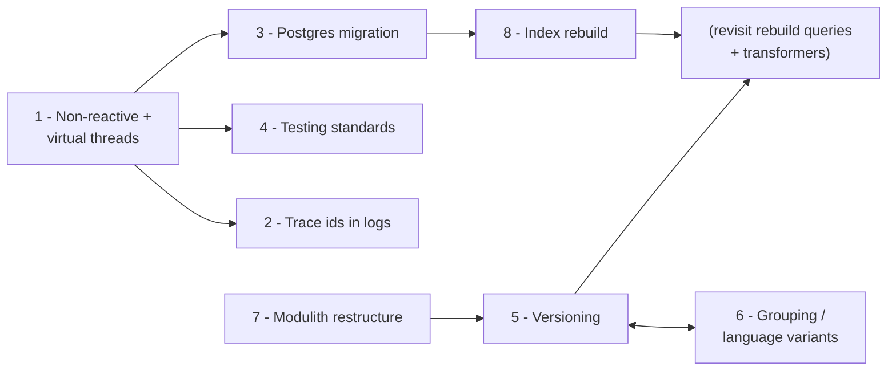

# Design Ideas / Roadmap

Planned design changes for this repository. Each item links to a detailed design doc where
one exists; the rest capture intent, known considerations, and open questions so they can be
fleshed out before implementation.

| # | Initiative | Status | Design doc |
|---|---|---|---|
| 1 | Convert reactive → non-reactive (virtual threads) | Mostly done | — |
| 2 | Micrometer trace ids in logs | Mostly done | — |
| 3 | MongoDB → Postgres migration | Idea | — |
| 4 | Bring tests up to new testing standards | TBD | — |
| 5 | Content versioning (live / working / history) | Idea | — |
| 6 | Content grouping (language variants) | Idea | — |
| 7 | Restructure into libraries / modulith | Idea | — |
| 8 | Index rebuild mechanism | Designed | [index-rebuild-design.md](index-rebuild-design.md) |

## 1. Convert from reactive to non-reactive (virtual threads)

Replace the WebFlux/Reactor stack with blocking Spring MVC-style code on the latest Spring
Boot and latest Java LTS, with virtual threads enabled (`spring.threads.virtual.enabled=true`).

**Rationale**: with virtual threads, blocking a thread on I/O is cheap, which removes the main
throughput argument for reactive. The remaining reactive advantage (backpressure-heavy
streaming) is not something this application does. Blocking code is simpler to write, read,
debug, and test — and it simplifies upcoming work (notably the index rebuild job, which
becomes a plain loop).

**Scope**:

- ~~`spring-boot-starter-webflux` → `spring-boot-starter-web`; controllers return plain
  values instead of `Mono`/`Flux`.~~ ✅ Done (`feat/non-reactive-mvc`), virtual threads enabled.
- ~~Reactive repositories → blocking ones (`ReactiveCrudRepository` → `CrudRepository`,
  `ReactiveElasticsearchOperations`/`ReactiveElasticsearchClient` → blocking equivalents).~~ ✅ Done.
- ~~Remove `Hooks.enableAutomaticContextPropagation()` (Reactor-specific; see item 2).~~ ✅ Done.
- `StepVerifier` is gone; `WebTestClient` test plumbing → `MockMvc`/`RestClient`
  remains (spring-webflux is now a test-only dependency; coordinate with item 4).
- ~~Upgrade Spring Boot and Java to latest (Boot 3.2.5 / Java 21 today; move to current LTS)~~
  ✅ Done (`feat/java-25`): Boot 3.5.14 / Java 25, Elasticsearch server 8.18 to match the
  client the Boot parent manages. Boot 4.x (Spring Framework 7) deliberately deferred.

**Notes**: keep R2DBC out of consideration for the potential Postgres move — plain JDBC on
virtual threads is the point of this conversion.

## 2. Micrometer trace ids in logs

Ensure every log line carries trace/span ids via Micrometer Tracing.

**Current state** (`feat/log4j2-trace-ids`): HTTP-request-scoped logs carry trace/span ids,
verified against the integration tests (all log lines of one `PUT /contentlets` save flow —
Mongo save + ES indexing — share a trace id). The logging backend is now **Log4j2**
(`spring-boot-starter-log4j2`; `spring-boot-starter-logging`/Logback excluded everywhere,
including test scope), which matches the Lombok `@Log4j2` loggers the code already used.
Correlation comes from Spring Boot 3.2+'s built-in correlation pattern (automatic when
`micrometer-tracing-bridge-brave` is on the classpath); the old custom
`logging.pattern.level` was removed — its `%X{traceId:-}` default-value syntax was
Logback-specific and rendered empty on Log4j2.

**Remaining work**: explicitly start/scope an observation for background work (e.g. the index
rebuild job in item 8, so all logs from one rebuild share a trace id — do this when item 8 is
built). Trace export (Zipkin/OTLP) deliberately not set up: log correlation alone is the goal
for now; no exporter dependency exists, so spans are created for correlation but go nowhere.

## 3. MongoDB → Postgres migration

Replace MongoDB with Postgres as the system of record.

**Scope**:

- **Schema**: the schemaless contentlet maps naturally to a thin relational shell around a
  JSON document — `id uuid PRIMARY KEY, data jsonb` (plus promoted columns later as items 5/6
  give fields real meaning). `ContentletEntity`'s `@JsonAnySetter` shape can stay.
- **Access technology**: decide between JPA/Hibernate, Spring Data JDBC, and jOOQ. The
  current repository usage is simple CRUD + the keyset query, so Spring Data JDBC is likely
  sufficient and the least magic.
- **Schema migrations**: introduce Flyway (or Liquibase) — first time the project has a real
  schema to version.
- **Ids**: native `uuid` column; adopt UUIDv7 for new ids (rationale in
  [index-rebuild-design.md](index-rebuild-design.md) → Database considerations).
- **Data migration**: corpus is tens of thousands of records — a one-off batch copy (keyset
  walk over MongoDB, insert into Postgres) is enough; no need for sustained dual-store
  operation beyond a short cutover window.
- **Infrastructure**: docker-compose `mongo`/`mongo-express` → `postgres` (+ pgAdmin if
  desired); Testcontainers MongoDB module → Postgres module in the test utilities.

**What gets easier afterwards**: real transactions (e.g. the atomic DB-delete +
deletion-log insert in the rebuild's Option B becomes trivial), and relational constraints
for the versioning/grouping identity model (items 5/6). `FOR UPDATE SKIP LOCKED` also becomes
available if job claiming ever needs it.

**Open questions**: query patterns against `data` (does anything need a GIN index on the
jsonb?); whether the ES "with content" hydration path changes at all (it shouldn't — it is
id-based).

## 4. Testing standards (TBD)

Bring the test suite up to a defined set of standards. The standards themselves are still to
be written — capture them here (or in a `docs/testing-standards.md`) before auditing the
suite against them.

Current conventions worth either ratifying or revisiting when standards are defined:
BDD-style nested classes (`@NestedPerClass`) with given/when in `@BeforeAll` and one
assertion per `@Test`; Testcontainers for MongoDB/Elasticsearch integration tests tagged
`IntegrationTest`; `@MockBean`-ing the indexer when ES is not under test.

**Open questions**: unit vs integration coverage targets; whether `IntegrationTest` tagging
should gate separate CI phases; test data builders; what replaces `StepVerifier` patterns
after item 1.

## 5. Content versioning: live / working / history

Each piece of content has a **working** version (draft, editable) and a **live** version
(published, what search/delivery serves), plus a retained **history** of previous live
versions.

**Use cases**: edit without affecting the published version; publish = promote working →
live; audit/rollback via history.

**Core principle — immutability**: the live version and all historical live versions are
immutable; the **working version is the only mutable record**. Every edit goes to working,
and publishing creates a new live version rather than modifying the current one (the old
live moves to history as-is). This keeps history trustworthy for audit/rollback, makes
"what was live at time T" answerable, and simplifies caching and ES indexing (a live
version's content never changes under its `inode` — only which version *is* live changes).

**Key design questions to resolve**:

- **Data model**: single collection/table with a version-state discriminator
  (`LIVE | WORKING | ARCHIVED` + version number) vs separate storage for history. The
  legacy-DMS field vocabulary already in `StandardDMSContentTransformer` is suggestive:
  `inode` (version-specific id) vs `identifier` (version-agnostic id) — versioning would give
  these real meaning: one `identifier` ↔ many `inode`s, of which one is live and one is working.
- **Operations**: save-to-working, publish (working → live, old live → history), unpublish,
  discard working, restore from history (copies the historical version into a new working
  version — history itself is never modified). What does today's `PUT /contentlets` map to —
  save-and-publish in one step?
- **Indexing**: presumably only the **live** version is indexed for delivery search; decide
  whether working versions get indexed separately (e.g. a `live` flag on ES docs — the
  `LIVE_FIELD` already exists — or a separate working index) for editorial search.
- **History retention**: unbounded vs capped (N versions / age-based).
- **Interaction with item 8**: the rebuild walks "all contentlets" — under versioning this
  becomes "all live versions (+ working, if indexed)". The keyset/checkpoint design is
  unaffected, but the batch query and the ES transformers gain version-awareness.

## 6. Content grouping (language variants)

A **group** of contentlets shares a common identifier; each member represents a variant of
the same logical content — primarily language variants (e.g. the same blog post in `en`,
`fr`, `de`).

**Key design questions to resolve**:

- **Group identity**: this is plausibly the same `identifier` concept as in item 5 — one
  logical content, many language variants, each variant having its own working/live/history
  chain. Decide deliberately whether group id and version-agnostic id are one concept or two
  (the legacy DMS model they echo treats `identifier` + `language` as the variant key).
- **API shape**: fetching by group identifier **returns all contentlets in that group**
  (e.g. `GET /contentlets/group/{identifier}` → every language variant). Beyond that:
  possibly a convenience fetch for a single best-match variant by language with fallback
  rules (requested language → default language?), and creating a variant of an existing
  group.
- **Constraints**: at most one variant per language per group; what happens on delete — does
  deleting the last variant delete the group?
- **Indexing/search**: search should likely be language-filterable, and "with content"
  hydration (see `SearchController`) may want to return the whole group or the best variant.
  The `language` field is already normalized by `StandardDMSContentTransformer`.
- **Interaction with item 5**: versioning is per-variant, not per-group (publishing the French
  version must not publish the English one). Designing items 5 and 6 together is strongly
  recommended — they share the identity model.

## 7. Restructure into libraries / modulith

Separate **core** functionality (persistence, ES indexing, generic REST endpoints, rebuild
job) from **content-type-specific** functionality (e.g. Blog transformers), so new content
types can be added without touching core.

**Options**:

- **Spring Modulith**: single deployable, enforced module boundaries
  (`core`, `contenttype-blog`, …), with verification tests that fail on illegal cross-module
  dependencies. Lowest ceremony; keeps the current single-app deployment.
- **Multi-module Maven build**: separate JARs (`contented-core`, `contented-blog`, an
  application assembly module). Heavier, but allows content-type modules to be versioned and
  shipped independently later.

**Notes**: the existing extension seams already point the right way — content types plug in
via `ContentletEntityTransformer` / `ESRecordTransformer` beans discovered by `List<T>`
injection, so the Blog-specific code (`BlogTransformer`, the Blog parts of
`StandardDMSContentTransformer.SUPPORTED_TYPES`) should extract cleanly. The current
package-by-feature layout (`contentlet`, `contentlet.elasticsearch`, …) maps naturally onto
modules. Start with Spring Modulith; promote to multi-module Maven only if independent
shipping becomes a real need.

## 8. Index rebuild mechanism

Implement the alias-swap rebuild designed in
**[index-rebuild-design.md](index-rebuild-design.md)**: generated-name indices behind a
stable alias; a cancellable/resumable checkpointed batch job (keyset pagination, job record
in the DB, heartbeat takeover, progress %); naive dual-write during the rebuild with a
catch-up pass + deletion log finalization (Option B); atomic alias swap with rollback window.

## Sequencing

Suggested order and reasoning:

1. **Item 1 first** — it is the foundation: the Postgres migration wants the blocking JDBC
   stack, the rebuild design assumes blocking code, trace propagation is simpler without
   Reactor, and tests get rewritten anyway, so doing it first avoids double work.
2. **Items 2 and 4 ride along** with the conversion (log verification and test rewrites are
   part of touching everything once).
3. **Item 3 (Postgres) next** — before the rebuild and the domain features, so the job
   record, deletion log, and keyset queries are built once against the final database, and
   versioning/grouping can lean on relational constraints and transactions from the start.
4. **Item 8 after the migration** — its design is done and deliberately DB-agnostic, but
   implementing it once on Postgres beats implementing on MongoDB and re-testing after a
   store swap.
5. **Item 7 before items 5 and 6** — versioning and grouping are the largest domain changes;
   better to land them inside clean module boundaries than to untangle modules afterwards.
6. **Items 5 and 6 designed together** (shared identity model: `identifier` / `language` /
   `inode`), then implemented in either order. Afterwards, revisit the rebuild job's batch
   query and ES transformers for version/variant awareness.
